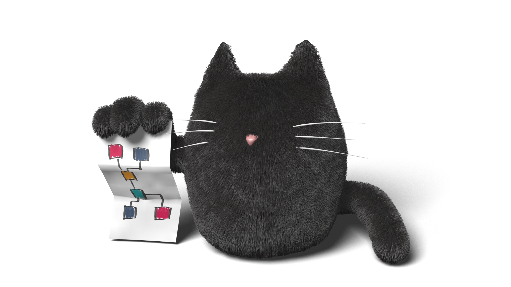

# Welcome!

Welcome to Graphcat ... the lightweight, flexible Python toolkit for managing
computational graphs.

While computational graphs are most often seen in computer graphics
applications, they are appropriate for any domain where you have a complex,
interactive workflow with downstream tasks that depend on the outputs of
changing upstream tasks.

Graphcat makes it easy to use computational graphs in your application, with
features such as the following:

* Tasks defined using standard Python functions or callables.
* No limitation on data structures / task outputs.
* Name tasks using any naming scheme you like.
* Support for advanced workflows including fan-in, fan-out, and loops.
* Built-in support for tasks based on Python expressions, with automatic dependency tracking.

You can see the full Graphcat documentation with tutorials at
https://graphcat.readthedocs.io ... for questions, comments, or suggestions, get
in touch with our team at https://graphcat.zulipchat.com.

* Current build status: 
* Current code coverage: 

License
=======

Copyright 2020 Timothy M. Shead

Licensed under the Apache License, Version 2.0 (the "License");
you may not use this file except in compliance with the License.
You may obtain a copy of the License at

   http://www.apache.org/licenses/LICENSE-2.0

Unless required by applicable law or agreed to in writing, software
distributed under the License is distributed on an "AS IS" BASIS,
WITHOUT WARRANTIES OR CONDITIONS OF ANY KIND, either express or implied.
See the License for the specific language governing permissions and
limitations under the License.
