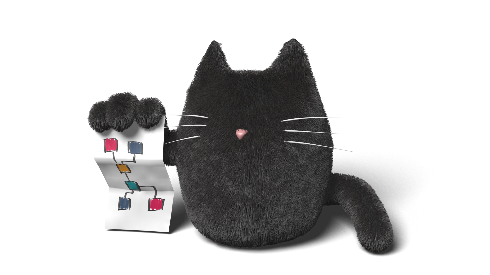

# Welcome!

Welcome to Graphcat ... the lightweight, flexible Python toolkit for managing
computational graphs.

If you have a workflow composed of tasks, and the tasks need to be completed in the right order, and the individual tasks are time-consuming so that you don't want to execute a task unless it's really necessary, keeping track of which tasks need to be executed can become extremely complex as your workflow grows, branches, and merges.

Graphcat is a tool that allows you to explicitly capture this kind of workflow in a *computational graph*, managing the details of executing each task in the proper order and at the proper time, no matter the state of the graph or the complexity of the workflow.  Graphcat doesn't care what kind of data your graph manages, doesn't dictate how you name the entities in the graph, provides advanced functionality like loops and expression-based tasks, and is easy to learn, with features including the following:

* Tasks defined using standard Python functions or callables.
* No limitation on data structures / task outputs.
* Name tasks using any naming scheme you like.
* Support for advanced workflows including fan-in, fan-out, and loops.
* Built-in support for tasks based on Python expressions, with automatic dependency tracking.

You can see the full Graphcat documentation with tutorials at
https://graphcat.readthedocs.io ... for questions, comments, or suggestions, get
in touch with our team at https://github.com/shead-custom-design/graphcat/discussions.

* Current build status: 
* Current code coverage: 

License
=======

Copyright 2020 Timothy M. Shead

Licensed under the Apache License, Version 2.0 (the "License");
you may not use this file except in compliance with the License.
You may obtain a copy of the License at

   http://www.apache.org/licenses/LICENSE-2.0

Unless required by applicable law or agreed to in writing, software
distributed under the License is distributed on an "AS IS" BASIS,
WITHOUT WARRANTIES OR CONDITIONS OF ANY KIND, either express or implied.
See the License for the specific language governing permissions and
limitations under the License.
